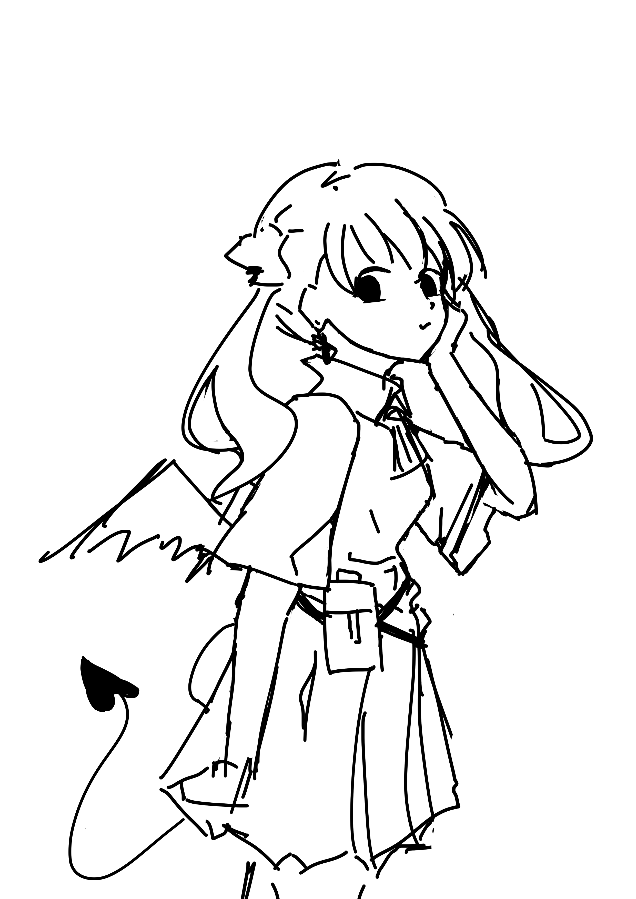
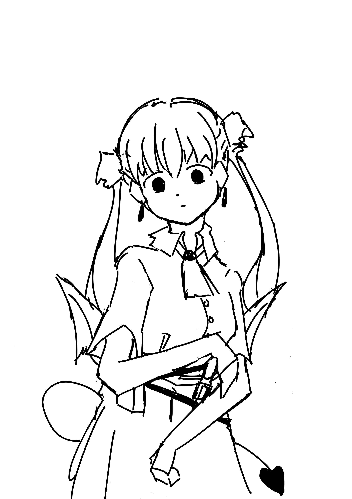

# 角色
NPC冒险家

莉莉姆·格利高里

魅魔侦探

## 立绘A
雌小鬼模式

## 立绘B
侦探模式

# Part 1
## 1.1
[任务触发地点 战士工会或类似的地方]
[与NPC莉莉姆对话后触发]

【莉莉姆A】
咦，那边的小哥，你是在跟我说话吗？

【莉莉姆A】
怎么说？打算接下本大人的委托吗？

原本只是想搭讪的你，被她的提问搞得一头雾水。
你解释说，自己不知道她在说什么。

【莉莉姆A】
委托啊！委托！
我做的好——大一张公告，贴在工会门口的。
只要走正门进来，就肯定会看到的吧！

1.	说在正门没有看到公告

【莉莉姆A】
什么！难道又被他们撕掉了？气死我了！！
这么大一张，打印也要好多钱呢！

少女大喊大叫着，狠狠瞪了身旁的工作人员一眼，靴子踩得地板嗒嗒响，给人一种非常孩子气的感觉。
工作人员露出了非常无奈的表情。

【莉莉姆A】
欸，算了算了。反正我的包里还有十几张。等他们走了我再贴上。

【莉莉姆A】
嗯？你问我写了什么？

【莉莉姆A】
喏。你看……

2.	说你是用肌肉打穿墙体从其他地方进来的

【莉莉姆A】
什么？难道真有这种奇人，明明有亮堂堂的正门不走，非要用肌肉！？
为什么？凭什么？

【莉莉姆A】
什么样的阻碍都用肌肉解决。用肌肉打穿墙体，用肌肉痛扁山脉。如果天空变得足够低的话，甚至想用肌肉绞杀太阳。
是这样的人，你是这样的人吗？

【莉莉姆A】
难道说……啊。我能感觉到，我能感觉到的！

【莉莉姆A】
你就是我梦寐以求的那种世不二出的肌肉型人才！！！

【莉莉姆A】
请务必要看一下我的委托！拜托了！

【莉莉姆A】
少女从包中取出她的巨幅公告。巨大标红的醒目字样看得你一阵眩晕。

3.	说你是盲人

【莉莉姆A】
什么？盲人？你觉得我有这么好骗吗！？

她鼓着脸凑近过来，双手在你面前挥了挥。大概是想确认你有没有眨眼吧。但从她的表情来看，反倒是把她自己搞糊涂了。

【莉莉姆A】
嗯……？咳咳。就假装你真的看不见好了！
本大人不跟你计较！

【莉莉姆A】
那我就念给你听听吧！委托的内容。

说着，少女从包中取出一张巨幅公告，字正腔圆地念了起来。

ENDIF

“告知汝等必将一事无成之人。”
“诚招……胸肌发达、腹肌发达、肱二头肌发达之肌肉战士一名……
“岗位，大侦探莉莉姆之亲卫兼助手兼肩部按摩仪……
“薪资面议。”

1.	“一般来说，不会有人在这种场合使用侮辱性语言。”

【莉莉姆A】
欸……？
你这一本正经的腔调是怎么回事。

【莉莉姆A】
这种说辞，难道不是很帅气吗。

2.	鼓掌

【莉莉姆A】
嗯！感谢你对本侦探的肯定！

ENDIF

【莉莉姆A】
总而言之，我看你还挺顺眼的。
虽然没有上手测量过你的肌肉，不过勉强算你合格了！

【莉莉姆A】
如何？面对本大人的邀请，你只能同意了吧！

1.	……

【莉莉姆A】
不要用这种看智障的眼神盯着我啊！

2.	“所以说，到底是本大侦探还是本大人？”

【莉莉姆A】
我爱用哪个用哪个！

ENDIF

【莉莉姆A】
对了！我还没有自我介绍。

【莉莉姆A】
本人名为莉莉姆·格利高里，爱好是红茶雪茄与竞速泳衣的肚脐。
种族为魅魔。
职业，侦探，全职！

【莉莉姆A】
虽然公众对我了解不多，不过本人，在圈子里姑且还是小有名气的！
同行们对我的手段颇有微词……嗯……引起了某些人的妒忌！

【莉莉姆A】
上个月我收到一份匿名邀请，说是准备好了适合我的舞台。
信封里附着一张船票，前往帕罗米亚的航班，豪华飞艇金色贡多拉号。

【莉莉姆A】
我很确定，这架飞艇上肯定会发生些什么。

【莉莉姆A】
飞行时间虽然只有一天半，但对训练有素的罪犯来说，这点时间已经非常足够了！

1.	“侦探的挑战书吗？还真是老套啊。”

【莉莉姆A】
大概不是什么轻松愉快的推理游戏，而是真的想把我干掉吧。
我们这行因为侦探人数过饱和了，地下的竞争是相当黑暗的。

1.	“所以，你需要一个保镖。”

【莉莉姆A】
是啊！毕竟寄匿名信的人可没有禁止我带帮手。
不过，相比保镖这个说法，我是真的需要一个助手来着。

【莉莉姆A】
知道最近的补充条款吗？侦探许可证的。
不知道……算了，总有机会告诉你的。

2.	“为什么你能这么肯定？”

她用双手比划着，向你说明她的“依据”。
什么嗅觉啊、灵感啊、清晨摘到的第一片树叶的形状啊。总之，全是毫无根据的臆测。
但是，因为她上蹿下跳的样子实在有趣，你没有忍心打断她。

ENDIF

【莉莉姆A】
丑话说在前头！本大侦探的推理方式，和你想象的完全不一样！
推理小说那种慢条斯理的模式，在我这里可找不到！

【莉莉姆A】
追求起点与终点之间的最短路径，这就是我的风格！

【莉莉姆A】
好了！距离出发还有一段时间，如果你还有事的话可以先回去准备。

【莉莉姆A】
……对了，还有什么问题吗？

1.	“你真的是侦探吗？”

【莉莉姆A】
怎么啦！我的外表难道就那么没有说服力吗！

【莉莉姆A】
你不相信也不要紧！反正到了船上，有的是我发挥的机会！

2.	“所谓的‘侦探圈’，究竟是个什么样的生态？”

【莉莉姆A】
因为需要跟谋杀案打交道的原因，有一个算一个都是坏东西！
明面上是互相恭维的关系，但在暗地里，仅仅因为对方比自己多了五千个粉丝就想把他做掉，这种事情经常发生。

【莉莉姆A】
没错，本大人，就是在这种黑暗的环境中摸爬滚打至今的！

3.	“金色贡多拉号是怎样的一条船？”

【莉莉姆A】
超级有钱人的豪华飞艇。
设施虽然称不上顶级，但那些贵族就是喜欢这种悠哉游哉，飘在天上的感觉。

【莉莉姆A】
没有这次的邀请的话，连我也不会选择这种交通工具的。

【莉莉姆A】
毕竟，船票比传送卷轴还要贵个几十倍。

4.	“为什么你认为我会接受委托。”

【莉莉姆A】
你是那种渴望冒险的人吧？

【莉莉姆A】
我可是侦探啊，这种事情还是看得出来的！

5.	“没有别的问题了。”

[选择5以外的对话选项，在对话结束后回到选项开头]

【莉莉姆A】
嗯！这次旅程会有点漫长，做好准备就告诉我吧！

【莉莉姆A】
我会在这里等着你的。

## 1.2
[if 队伍人数大于1]

【莉莉姆A】
做好准备了吗……？哎呀，不要带你的朋友来呀！

【莉莉姆A】
侦探都是秘密行动的！助手只需要你一个就可以了！

[else]

【莉莉姆A】
做好准备了吗？

1.	出发吧
2.	再等一下

# Part 2
## 2.1
[场景：黑屏，纯文本，或者卡普尔码头]

午后，你们前往港口，在接待员的陪同下登上了小艇。
船夫慢悠悠地划起船，从拥挤的港湾中穿行而过。卡普尔港实在热闹得很，一箱箱的货物运入港口，或是从港口运出。高耸的船体与更为高耸的桅杆，斜挂的帆布与蛛网般的绳索，视野中尽是这些东西。皮肤晒成古铜色的船员手脚并用地爬上瞭望台，精神饱满地互相招呼着。

而在不远处的海面上，浮着一艘外观酷似雪茄的金色巨物，在烈日的直射下明晃晃地发着光。金属的外壳，流线型的外观，连发动机的整流罩都是干干净净的。在这座弥漫着鱼腥味的脏兮兮的港口中，华贵得仿佛杂物堆中的珠宝。

这就是你们此行的目的地。
全长七十余米的豪华客运飞艇，金色贡多拉号，停泊在港口附近的海面上。

船夫把小艇停靠到飞艇边上，把绳索抛给飞艇上的工作人员。你和莉莉姆同时站起身，正当她跨步准备下船时，一个浪花打来，她一个踉跄，差点落进海里。
幸好，你及时扶了她一下。她下意识地道了声谢。

## 2.2
[场景：飞艇双人间内]

【莉莉姆A】
呀啊！终于到啦！

现在进行时的伟大侦探，莉莉姆·格利高里连外套都没脱，面朝下倒在双人间的豪华大床上。
她腰带上插着的某样东西反射着阳光。一把.357口径的左轮手枪。

【莉莉姆A】
船票实在太贵啦，我原本还想把你当作行李托运。
结果服务生说，不行呀！就只好加钱定了这个双人间……

半晌，见你没有反应，莉莉姆翻过身来。

【莉莉姆A】
本大人在跟你开玩笑欸！你怎么一点反应都没有！

1.	“对不起，我以为你是真的有点蠢。”

【莉莉姆A】
说什么话呢！笨蛋的角色不是留给你了吗！ 

【莉莉姆A】
而且，听到别人讲笑话，哪怕再蠢，听众也有义务笑出来。
这可是社交礼节欸！

【莉莉姆A】
好啦！虽然要做的事情还有一大堆，但一倒在床上就全忘了……

【莉莉姆A】
就这样！解散！
我的侦探直觉告诉我，案件说不定马上就发生了，现在必须养足体力才行。
你就先去船上晃晃好啦！

她又翻身回去，蹬直双腿。不一会儿便打起鼾来。
看起来莉莉姆是真的累了。直到飞艇起飞前还有一段时间，先去外面逛逛吧。

## 2.3
[场景：飞艇双人间外，过道]

和服务生攀谈过后，你大致掌握了这条船的布局。
你们所在的这一层是金色贡多拉号的主要活动空间。
船首是半开放式的瞭望台，设有三架观景用的望远镜。
中部靠前的舱室则是旅客的套房，也就是你和莉莉姆所在的位置。服务生说，为了照顾旅客的需求，不仅是这几间套房，船上每个舱室的隔音效果都特别好。
本楼层的正中央是酒吧，兼作食堂使用，旅客和船员都在此处用餐，厨房是半开放式的，据说可以看见主厨在这里宰杀活牛。
至于酒吧后方的空间，则是被称为娱乐厅的大型区域，一直延伸到船尾。这里设有小型舞台，可以观看从脱衣舞到诺耶尔大鼓书的一系列表演。赌场设施亦是一应俱全。

至于其他的楼层。在你们头顶的是仅限船员进入的控制室与动力室，旅客是无法进入的。底下则是货舱，存放着你们的行李与压舱物。

总之，或许是被大侦探阁下的气氛感染，连你都隐约嗅到了事件即将发生的氛围。
事已至此，或许先把能去的角落逛个遍比较明智。

## 2.4
[（唯一的）自由行动场景]

### 【货舱-服务生】
你好，这位乘客。需要帮你找行李吗？

1.	“里面这些乞丐是干什么的？”

他们是飞艇的压舱物，用来调节飞艇重心和总重的。
必要的时候，也可以直接排出舱外。

1.	“你们哪里找来的这么多乞丐？”

其实，他们以前和你一样，也是一名冒险者。

直到他们的mod报了红字。

1.	“真是悲伤的故事。”

失去了名字和技能的他们没法承担正经工作，好在本公司向他们抛出了橄榄枝。
能担任这艘豪华客运飞艇的压舱物，毫无疑问是这群废物的福分。

---

### 【酒吧-酒保】
我认为，原则和边界是这世上最重要的事。
一件事该是怎样，不该是怎样，必须分得清清楚楚。

比如说，鸡蛋就只该有生鸡蛋和熟鸡蛋两种状态……

1.	“那，孵出来的小鸡呢？”

不！你没有煮过鸡蛋吗？
小鸡是鸡！不是鸡蛋！

### 【酒吧-嘴很碎的服务生】
这里的主厨是个个性很强的家伙。怎么说呢，脑子有点不正常。
他喜欢在众目睽睽下宰杀动物，把血抹到白纸上，画出各种奇怪的图形。

我怀疑他以前是个杀人魔。

1.	“也可能是艺术家吧？”

那不是比杀人魔更糟吗。

### 【酒吧-喜欢推理的服务生】
听说这次航班来了一位持有特许证的正牌侦探。
怎么办！要不要问她要个签名呢？

### 【酒吧-珍惜生命的冒险者】
旁边那个服务生，一听到有侦探在船上就兴奋的要死。
我可是怕得很呢……

听说，有的侦探疯起来连证人都要杀光……

---

### 【娱乐厅-主厨】
妹妹。你最好再考虑下上次对你说的事……

### 【娱乐厅-兔女郎舞者】
现在是午休时间。
别骚扰我。

### 【娱乐厅-画家】
知道了我的职业后，我被那边的服务生狠狠瞪了一眼。
这个世道为什么这样，对我们这些艺术的仆人太不公平了！

1.	“你平时都做些什么？”

做什么……？像是文艺沙龙啊，参加画展，还有跟美术馆的老板搞好关系……
社交就是很重要啊！没什么值得奇怪的。

船上有个外光派的同行，我刚跟他交换了名片。但老实说，我个人还是觉得呆在室内更好。

### 【娱乐厅-富翁的妻子】
他总喜欢把金钱和秩序挂在嘴上。
但结婚这么多年了，我还是无法忍受他的怪癖……

1.	“大家都有自己的癖好，没有什么好大惊小怪的。”

你啊，别因为跟自己无关，就随便说风凉话啊。

2.	“什么怪癖？”

他喜欢在空中拉屎，光着屁股，朝向地面拉屎。说是能感受到重力的，呃，脉动。
没错……这就是为什么我和他在这条船上。

---

### 【瞭望台-富翁】
过去曾有暴力凌驾于一切事物的时代，好在如今的世界变得文明了。
名为金钱的秩序统治着这片大陆。即使你是国王，也必须低下头来尊重金钱的力量。

### 【瞭望台-担心受怕的服务生】
嗯？其他人没有告诉你么？其实，这次航班的大多数服务生都是新来的。
之前船员聚会的时候，不知怎么搞得食物中毒。公司只好调新人填补空缺。

大家都不熟悉这条船。要是有罪犯想暗中行动的话，我们岂不是会被耍的团团转……

呃，是我想太多了？好吧。

### 【瞭望台-大城市的冒险者】
我在想，是不是也该放弃这份工作了。
最近不知道从哪冒出来一大堆冒险者同行，属性能力一个比一个强，画风还跟我们不一样。
真活见鬼了，最近真的接不到单子了。

1.	“要不回老家种地吧。”

嗬。哪有地能种。
我家祖孙三代米西利亚人，又不是你们这帮乡下来的。

### 【瞭望台-画家】
要是没有这个瞭望台，我也不会买这么贵的船票。
从云端向下眺望的话，究竟能看到怎样的色彩呢？

……嗯？为什么那边的舰体上，有一团可疑的深棕色……？
## 2.5
[场景：飞艇双人间]

差不多是时候了。当天下午两点整的时候，服务生们一路摇着铜铃，从船首慢悠悠地走向船尾。这是在提醒游客，金色贡多拉号马上就要启航了。

不一会儿，你感受到了引擎发动时的振动。这阵动静有点安静得出乎意料，没有震耳欲聋的噪音，振动也仅限于起初的一瞬间。简直让人怀疑是不是搞错了。
然而，当你透过舷窗向外眺望时，却分明地发现飞艇正在离开水面。桅杆的芦苇丛、连缀的三角形帆布，全都慢悠悠地向下移动着。水手们停了手上的活计，仰起头向你们挥手。你也向他们招了招手。

莉莉姆醒了，一脸睡眼惺忪的样子。她无精打采地盯着你，像是盯着一个陌生人。说起来，你们确实才没认识多久。

【莉莉姆B】
嗯……你是……

【莉莉姆B】
是我的助手，对吗？
调查进行得如何了，找到凶手留下的线索了吗？

1.	“杀人案还没有发生呢，我亲爱的名侦探小姐。”

【莉莉姆B】
船上刚有人被杀害了哦，我能感觉得到。

1.	“那为什么不起床？”

【莉莉姆B】
因为我在想今天的下午茶吃什么。
蜂蜜蛋糕和蟹粉小笼，你觉得选哪个好？

1.	“我不觉得会有哪个餐馆同时供应这两种食物……”

她原本直起了上半身，听到你的话后，又“哎呀”一声倒在了软绵绵的白色大床上。整个人都陷了进去。
像是在说，既然这样我就不起来了。

1.	“连杀人案都能感应到的大侦探，居然这样就被打倒了吗？”

不。她摆摆手。我在思考其他的事。
她闭上眼睛，像是又睡着了一般。当你终于忍不住想叫醒她的时候，她突然从床上一跃而起。

【莉莉姆B】
说的也是呢！我们走着瞧吧。
介意带我去船上逛逛吗？

她突然像是换了个人似的，你多少有点惊讶。
为她拉开房门的时候，她再次轻轻道了声谢。

## 2.6
但没过多久，她又变回了那个脑子缺根筋的小女孩。
在她对着酒保大声嚷嚷的时候，你不得不假装不认识这个特立独行的疯子。

【莉莉姆A】
所以说！为什么啊！
菠萝披萨到底哪里出问题了！ 

【酒保】
这位客人！菠萝和披萨！是两个绝对无法并置的概念！
菠萝是菠萝！披萨是披萨！菠萝披萨不是菠萝，不是披萨，更不是菠萝披萨！ 

【莉莉姆A】
你们这帮顽固不化的基要主义者！
为了美食的未来，我要肃清你们！我莉莉姆·格利高里说要肃清！

【酒保】
客人！但！我再说一次！这不仅仅是理念的问题！
我们的主厨，船上唯一会烤披萨的人……刚才病倒了！

【莉莉姆A】
那你呢！你明明穿着制服站在这里，你会做的菜是什么！

【酒保】
我是酒保。酒保啊！酒保！

【莉莉姆A】
我问你会做什么菜！

【酒保】
酒保不会做菜！

【莉莉姆A】
我问你会做什么菜！！！

【酒保】
微波炉煮鸡蛋。

现场陷入短暂的沉默。趁他们中的任何一个人发飙之前，你赶紧把莉莉姆拖走了。回到房间后，你又废了好大的功夫才让她安静下来。

# Part 3
## 3.1
[场景：飞艇双人间]
你把自己和莉莉姆关在双人间内，就这样一直等到晚餐时间。正当你睡眼惺忪之时，身后的房门突然发出咚的一声巨响，吓得你几乎弹起来。你急忙开门查看，却连人影都没有看到。走廊安静得不同寻常。
不好的预感越来越强烈了。

【莉莉姆A】
怎么了？

莉莉姆无精打采地问。

1.	“没看到人，可能是不小心撞到了。”

【莉莉姆A】
喂，我说，也是时候让我出去了吧。

莉莉姆坐在她的床上，双手抱胸，眼睛死死盯着你。而你则是搬着一把椅子守在门口。在过去的几小时内，你们就这样大眼瞪小眼。

1.	“好吧，也是时候吃晚饭了。”

【莉莉姆A】
你明明只是个助手，为什么反过来监禁起了本大人啊喂！

1.	“控制受害范围也是助手的职责。”

## 3.2
[场景：飞艇酒吧]
抵达兼做餐厅的酒吧后，现场的气氛果然有些不同寻常。方才见到的富豪夫妇坐在中央的圆桌旁，两人背对着彼此，似乎不久前刚吵过架。其他人则零零散散地坐在船的右舷。几名手足无措的服务生靠在左舷的墙上，似乎谁也不肯先开口。
餐桌上全都空空如也，不知怎么的，连刀叉碗盘都没有。

【富豪】
到底还要我们等多久！不就是没了一个主厨，这么大一艘船连这种小事都处理不来吗！

【担心受怕的服务生】
非……非常抱歉。
实际上，这次航班我们有些人手不足……厨师只安排了一位。

【富豪】
那就是吃不上饭吗！
你知不知道你们这艘金色贡多拉号，我个人赞助了多少！？

你们赶紧找了个边缘的位置坐下，其他乘客也和你们一样，等着看他们的好戏。
正当富豪猛地冲上去，几乎就要打起来的时候，另一伙服务生慌忙地推着三辆餐车进入了酒吧。

【喜欢推理的服务生】
非常抱歉……！！
我们发现了主厨烤好的肉！这应该就是他准备的晚餐。

【喜欢推理的服务生】
烤肉！全属性加成的最优质的五花肉！
还有！还有，为了补偿各位，今天的水果……还有……纪念品……也会、也会、也会……

餐前，看着这些手足无措的人为保住饭碗做的垂死挣扎，多少也算是个余兴节目。
但是，相比于同情这些人，你更好奇究竟发生了什么。

## 3.3
[场景：飞艇酒吧]
十分钟后，当那些“高优先级”旅客全被伺候到位后，你们的餐盘才终于端了上来。
可是，矛盾还没结束。刚才的富翁再次瓮声瓮气地谩骂起来。似乎说是肉的烹饪方法有问题。其他旅客也是一脸心照不宣的表情。
面前的烤肉也不如想象中那样呲呲冒着热气，完全就是凉掉了的样子。

你试探性地尝了一块，的确，就连对食物完全不挑剔的人也尝得出来，这盘肉做得大有问题。
但你还没有来得及思考这意味着什么。突然，你看见莉莉姆高举着右手，快步走到酒吧中央。

【莉莉姆A】
你们好！我知道大家和我一样，全都被这不幸的意外搞得饥肠辘辘。
但有一件事，我认为大家还是早点知道为好。

讲到“早点”二字时，她加重了语气。
她挑衅般地扫视了一眼周围。吃得最快的人已经在用餐巾抹嘴唇了。

【莉莉姆B】
我不喜欢故弄玄虚，所以直接跳到结论——
主厨被杀了。他的尸体被切碎了做成烤肉，现在就在各位面前的餐盘中，或是各位的胃里。

# Part 4
## 4.1
谜题隐藏在烤肉之中

突入谜题之时
谜题唤来更多谜题

无谜之谜诞生谜题
前往谜题之路上谜题何去何从

贯彻解谜浪漫！ 

上吧！杀害主厨的凶手就交给你了！

聚光灯亮起。
四名嫌犯头上蒙着白布，双手反绑，一字排开坐在房间中央。

1.	“等等！！！”

【莉莉姆B】
怎么了？有什么疑问？

1.	“我说等等！这个展开也太突然了！”

1.	“你难道不打算说明一下现状吗？”

【莉莉姆B】
这里是我用魅魔能力制造的“没有破案就出不去的房间”。
在你面前的是本案的四名嫌犯。

【莉莉姆B】
身为胸肌发达、腹肌发达、肱二头肌发达之肌肉战士。
你的任务，就是使用你的肌肉，对他们四位进行推理。直到将每个人都认定为真凶为止！

1.	“我完全不懂你的意思。推理，难道不是应当从收集证据开始？”

【莉莉姆A】
提问！
为了解决案件，侦探最需要的能力是什么？

1.	“……观察能力？”
2.	“……逻辑思维能力？”
3.	“……将思维逆转过来的能力？”

【莉莉姆A】
不行啊，这种想法完全不行。
你以为这是什么推理小说吗！

【莉莉姆A】
先调查线索，再慢悠悠地锁定犯人。
吊胃口的悬念。故弄玄虚的推理。在戏剧高潮华丽揭露的真相。
难道你期望的是这种东西吗！

【莉莉姆B】
听好了，我的助手。
侦探的目的，唯有单刀直入，然后结案，仅此而已。

【莉莉姆B】
过程不重要。不仅如此，有时连真相都不需要。
只要能将犯人定罪，判处死刑。除此以外的一切全都可以舍弃。

【莉莉姆B】
无论是什么样的杀人案件，无论是什么样的杀人凶手，都以最短的路径直通终点。
无论是什么样的障碍，都无法阻碍侦探的脚步。
无论是什么样的意外，什么样的糟糕天气，侦探都要如履平地。

【莉莉姆B】
为了达到这种境界，侦探需要的不是技艺，而是暴力。

【莉莉姆B】
所谓的演绎法、现代侦测技术、问询技术，如此等等，就好比是开瓶器，是破案的工具。
使用工具固然有效，但是，面对不同的难题，工具也有失灵的时候。
你难道能用开瓶器战胜霸王龙吗？

【莉莉姆B】
如果徒手就能做到同样的事的话，这种工具对我们又有什么用呢？
将过于依赖工具，而变得羸弱不堪的肉体逼迫到极限——
区区霸王龙，难道能战胜久经锻炼的肌肉吗！？

【莉莉姆B】
侦探的真谛！就在于使用肌肉直接攻击！

【莉莉姆B】
真相！只有一个！

【莉莉姆B】
但是侦探的拳头！却有两个！！！

【莉莉姆B】
证人不愿开口的话，就殴打证人！
证物没有意义的话，就殴打证物！

【莉莉姆B】
嫌疑人不肯招供，就用关节技固定他的身体，连续攻击下颚直到口吐白沫为止！

【莉莉姆B】
所以，你要做的事情只有一件。

【莉莉姆B】
殴打！殴打！直到案件的真相，自然而然地从犯人的嘴里吐出来为止！

【莉莉姆B】
好了，我想你完全理解了推理艺术的真谛。

【莉莉姆B】
去吧！我的助手，就将这个案子作为第一课。
用你的肌肉找出凶手吧！

## 4.2
[可能是一些战斗]

左起
兔女郎 大城市的冒险者 喜欢推理的服务生 酒保

## 4.3
你充分地殴打了在场的每一名嫌犯，直到每个人都跪地求饶，承认自己杀了主厨为止。
甚至，你还没来得及问你身边的大侦探小姐，他们每个人都是出于什么原因才被她认定为嫌犯的。

【莉莉姆B】
嗯哼，我亲爱的助手。作为第一次推理，你完成得很不错。

【莉莉姆B】
虽然你真的很有天赋，但我想你需要休息一下。

莉莉姆斜坐在角落的吧台椅上，把她的威士忌放回酒吧车顶部。
她拉开酒吧车的下层抽屉，取出另一只宽口威士忌杯，又用方巾简单擦了擦杯口，抬起眼来看着你。

【莉莉姆B】
威士忌？

1.	“冰块，不用加多。”

【莉莉姆B】
老实说，我不太懂给人添酒的规矩。
我这人只喝闷酒，一边喝，一边数墙纸上的花纹。

她给你倒上四分之一杯酒，夹进去几粒还没融化的方冰。

【莉莉姆B】
将就吧。正规酒吧才有专用模具，做出来的冰块都是漂漂亮亮一大颗。
我这可没有这种待遇，相信你也不在意。

说着，她挑衅般地瞟了一眼跪在地上的酒保。

2.	“不了。给我倒一点苦艾。”

【莉莉姆B】
哦，你眼睛还挺尖的。这瓶我没怎么碰过，因为我实在受不了这种药草味道。
杯子只有这种。放块冰糖？

接过酒后，你注意到莉莉姆托着腮，用期待的眼神盯着你。
你只好在她的监视之下抿下一口。

原来如此。她点点头，神情好像是在说，原来喝这种酒的人会露出这种表情。

【莉莉姆B】
我对酒真的不是很在行。你知道的，有人把它当作是一门严肃的学科，我觉得只是饮料而已。
不过嘛……不管怎么说，世上确实有以酒为生的职业。

说着，她挑衅般地瞟了一眼跪在地上的酒保。

3.	“我不喝酒，有可乐吗？”

【莉莉姆B】
没有这种东西。我的天哪，你这人真是没有情调。

莉莉姆努努嘴，把多余的杯子放了回去，随后拿起她自己的杯子，小抿了一口。

【莉莉姆B】
你甚至不肯给我一个冒充酒保的机会。
啊，让我猜猜看，你从来没看过西部片，也不看所谓的黑色电影，所以你不懂罗曼蒂克，是不是？
不过，丑话先说在前头。不管是什么样的电影，“正牌”的酒保，下场通常都不太好。

说着，她挑衅般地瞟了一眼跪在地上的酒保。

ENDIF

1.	“好了。接下来要干什么？”

莉莉姆从椅子上站起来，缓步踱到你身旁，一边从上衣的内侧口袋中取出一叠折得整整齐齐的文件。展开，展开，再展开。

【莉莉姆B】
各位！放轻松！
既然四位都已经认罪，我想，对各位来说，整件事最艰难的部分已经过去啦。

【莉莉姆B】
不过，对我们来说，真正的演出才刚要开始！
没错，我的助手方才所作的是暖场表演。
你们有去现场听过语言类节目吗？业余人士表演的单口相声？和那个很类似。

【莉莉姆B】
这个话题可能有点唐突。我不知道在座的各位对北提里斯的治安情况了解多少？
你觉得生活环境安全吗？这个世界和平吗？犯罪者有得到应有的惩罚吗？
人们总是在谋杀中匆匆死去，对于这个事实，你感到满意吗？

【莉莉姆B】
要知道，在北提里斯，偷几块金砖，杀几个拦路人都不足以让你成为罪犯。
你得在犯罪的道路上不断精进，才会被社会视为真正的犯罪者。
想在这种地界寻求公平正义，并不比在自家后院寻找秘宝容易。

【莉莉姆B】
但是！

莉莉姆高举文件，露出真诚的微笑。他们四人都蒙着眼，压根看不见她的肢体语言。

【莉莉姆B】
侦探制度！自从一百五十年前，时任帕罗米亚国王在三级会议上批准自由市代表的提议，正式建立侦探制度以来，已有无数名谋杀案的受害方从此获益。

【莉莉姆B】
哦！在侦探制度的光芒下，罪人得到审判！正义得到伸张！杀人不眨眼的恶徒，在侦探面前也是野狗一条！
妈妈咪呀。这个世上原来真的有天理存在。

【莉莉姆B】
自此以后，哪怕是在那些真理的光辉照耀不到的地方，也有鄙人这种在窄缝里自由穿行的老鼠，为微不足道的芸芸众生们送去饼干屑大小的正义。

【莉莉姆B】
至于这种美妙制度的核心，就是我手里这份文件。

莉莉姆再次挥舞文件，背过身，向吧台椅的方向走去。

【莉莉姆B】
帕罗米亚大使馆签署，侦探特许证，凡持此证件者，将获得在北提里斯境内的特别执法权。
所谓的特别执法权，通俗来说就是，只要谋杀案发生，且现场没有一般意义上的执法人员，侦探就将获得几乎无限大的自由调查权。
甚至，只要犯人认罪，侦探可以根据判断自由行事，现场审判，现场执行。

莉莉姆背对着你们，双手似是捧在胸前。

【莉莉姆B】
我知道你们的顾虑是什么。这种制度，实质上让侦探们成了真正的法外之徒。
要是侦探都是好人，那还好说。但要是让坏蛋成了侦探，就拿已经认罪的你们四位来说吧，岂不是你们所有人的命都握在我手中，我想枪毙谁就枪毙谁？

【莉莉姆B】
小时候，我的家人信仰一个什么律法之神。他们的终极理念，就是把善恶变成某种矿物资源一样的东西。可以买卖，可以交易。

【莉莉姆B】
从那时起，我很讨厌这种人。我记得有一个酿酒的叔叔，他用土块锻成的肉做葡萄酒，把这种东西卖给成千上万的人。
这样的人居然被认为是道德模范，就因为他总是定期购买赎罪券。这种事情也太奇怪了。

【莉莉姆B】
对不起，我好像有点偏题了。

【莉莉姆B】
我本来想说的是，所谓的好人坏人，就不存在什么靠得住的标准。
我们没法只让好人当侦探。事情就是这样。

【莉莉姆B】
好侦探，坏侦探。好侦探遵纪守法，有原则，有智慧。
坏侦探只会胡搞一气！开出各种理由严刑逼供，把证人当成犯人！无所不用其极，动不动就把人打一顿！打一顿！

四名嫌疑人大气不敢出一口，静静地听着莉莉姆的话。

【莉莉姆B】
各位！不用太紧张！所以说啊，这确实是个问题。
最近十多年里，也一直有民间人士想要修改法律，削减侦探们的权利。

【莉莉姆B】
不过嘛……

你听见那叠文件轻轻落在吧台椅上的声音。

【莉莉姆B】
不过嘛……我本人的话，对于法外之徒这个身份——
还挺享受的。

【莉莉姆B】
毕竟，人就是要胡作非为才活得快活，你们不这么认为吗？

她故意顿了顿，像是在等待你们这群听众给点反应。

【莉莉姆B】
对了！还有一个坏消息要告诉大家。

【莉莉姆B】
在坏侦探当中，我也是最坏的那一种。

莉莉姆猛地转身。手枪开火。.357弹头呈直线射入第一名嫌疑人的眉心。

穿透。碎裂。残留的动能将她的整具尸体猛地向后推去。咚的一声倒在地上。
脑袋残留的部分歪倒在一旁，血咕嘟咕嘟地从新开的口子里涌出，样子有点滑稽。

其他人歇斯底里地尖叫起来。

血溅到了莉莉姆的左手，她抬起手，有些好奇地观察着那滴液体在手背上留下的形状。然后像猫舔爪子一样，把血迹舔掉了。

【莉莉姆B】
各位！稍安勿躁。

【莉莉姆B】
我知道你们有些人急着想翻供，不过，请允许我给你们一个小小的提示：在空气中，子弹的速度比声音更快。还有，我的听力不太好，要是被枪声盖住的话，可就听不见各位的话啦！

【莉莉姆B】
所以，不要说对自己的寿命不利的话，好吗？
我还有些话想问，所以一个一个来。算我求求你们啦。

但她是在虚张声势。她的左轮里只装了一发子弹。在他们缓过神来之前，莉莉姆慢条斯理地打开弹巢，把弹壳退出来。然后抬起手指。
一、二、三、四……哦，不好意思，她喝得有点醉，把你也给算进去了。你急忙后撤一步。
一、二、三。还剩三个人，莉莉姆打开腰包，挑了三颗子弹塞进弹巢。

【大城市的冒险者】
不！你这是违法的！侦探特许证的附加条款，上周就应该生效了！
按照当下的规定！审判时必须设置临时法庭。你现在的行为和谋杀没有区别！

排在第二位的嫌犯——那个大城市来的冒险者——他光秃秃的脑门上汗如雨下，嘴却因极度的愤怒与恐惧扭曲得不成造型。
如果说人的情绪是一碗炖菜，那么他一定混合了从甜到辣的每一种滋味。

【莉莉姆B】
哦！临时法庭，感谢你的补充说明。其实，我刚打算讲到这部分。

莉莉姆慢条斯理地拿起文件，翻出了最底下那张。

【莉莉姆B】
附加条款！当然！同样由大使馆签署。根据条款规定，设立临时法庭需要满足以下条件……
现场设施，足量的椅子，临时法官和被告各需要一张桌子。
椅子是没问题，但桌子……

莉莉姆惊恐地扫了一眼房间。
就算把酒吧车算上，房间里也只有这一张桌子。

【大城市的冒险者】
这种事情无所谓吧！！！没有又怎样！
其他的条件都无所谓！关键是陪审员！临时法庭需要陪审员！

【莉莉姆B】
哦！非常感谢你的合作！
不过说到陪审员的话，你大可不必担心。条款没有对陪审员的数量做明确规定，像这次这种鸡毛蒜皮的小案子，我想一名就足够了。

【莉莉姆B】
这名陪审员，需要满足以下条件。
第一条，陪审员与担任临时法官的侦探之间没有血缘关系。

【莉莉姆B】
助手！我和你有血缘关系吗？
不过，我想这件事是显而易见的，需要现场做一个滴血认亲吗？

1．	“……”

【大城市的冒险者】
等等！让你的助手当陪审员？这是不合法的！
陪审员要和侦探彻底撇清关系，别给我打马虎眼！

【莉莉姆B】
先生，你可先别着急，让我把附加条款的限制，一条一条念给你听。

【莉莉姆B】
第二条！陪审员与担任临时法官的侦探之间没有经济往来。
助手！虽然我口头许诺你酬劳，但其实我还一分都没付吧？

1.	“……是这样。”

【莉莉姆B】
第三条，陪审员近期无犯罪记录，这个你也符合。大概。
第四条，陪审员应当成年。这个也没问题。
第五条，陪审员不得有智力残疾。嗯……是的！通过！

【莉莉姆B】
那么，最后一条。陪审员与担任临时法官的侦探之间不能事先认识。
我亲爱的助手，回答我是或者不是。我们确实刚认识没多久！要不是机缘巧合让我们坐上了同一个航班，我们将完全不认识彼此。是或者不是。

1.	“……”

她故意把话说得含糊不清。但在这种场合，你也只能顺着她的想法说是。

【莉莉姆B】
好了！对于我这名陪审员的任命，我想在场的各位都没有意见，在各位的监督下，这次任命是完全合法合规的。
那么，临时法庭就此成立！本法官在此宣布——

【大城市的冒险者】
等等！你他妈放什么屁——

枪声再次响起。这位勇敢的异议者仰面倒在地上，呻吟了一声，然后便再也没有动静了。

房间里安静得出奇。你们听见莉莉姆拨动击锤的声音。
紧接着，又是一声枪响。那个始终没有说话的服务生也倒了下去。

【莉莉姆B】
本法官宣布，判处二位死刑。

【莉莉姆B】
希望这次的事情能给你一个教训：永远不要跟已经开过枪的人谈法律。

方才的四把椅子只剩下一人。酒保是个年纪不大不小的汉子，照说也跟着船见过不少世面，但现在也只是一味颤抖着。脸上蒙的布夺走了他的视力。他的牙齿打着战。

【莉莉姆B】
好了。我想我稍微玩得有点过火了。浪费了太多时间，是不是？
最后的这位酒保先生，我就不问你有什么心得感想了。
不绕圈子了。我们来做个交易吧？

【莉莉姆B】
听好了，这些话信不信由你。不过嘛，我们的组织最近对死刑的执行人数看得有点重。
简单来说，放过你，只杀他们三个，我可以少做一堆文书工作。

【莉莉姆B】
要是把你也给毙了，我就得多写一堆报告。指数级上升，理解我意思吗？

【莉莉姆B】
我是个很懒，很懒的人。
所以我真的很讨厌搞装模做样的推理，不想调查证物，不想询问证人。
你懂我意思吗？所以我当然也不想写报告。

【莉莉姆B】
所以，我们做个交易。你把作案的细节一点一点，事无巨细地告诉我，不要错过一个指甲缝的细节。你一定要非常详细地告诉我，是谁给你们出的这个主意，那个人在不在这条船上。
答应我的话，我会把你列为从犯，不动你一根毫毛。

【莉莉姆B】
如果我是你的话，我会觉得这个提议很有诱惑力……
毕竟，那个女人从一开始就在利用你，不是吗？

【莉莉姆B】
要是你还不肯合作的话……我也有别的方法能从你身上掏出情报。

【莉莉姆B】
人只有活人和死人两种类型，对吧？
……但对训练有素的拷问者来说，其实还有第三种……

莉莉姆顿了顿，观察着酒保的反应。

【莉莉姆B】
真聪明。好了，告诉我吧，你和那个兔女郎是怎么把主厨杀掉的。

酒保沉默了很久，非常久。然后他开始用非常小的声音说话，莉莉姆不得不把耳朵凑到很近才能听见他在说什么。
你试探着走近一步，但他的声音实在太轻了。你最终放弃了偷听的念头。

他们讲了很久很久的话。久到你突然想确认一下躺在地上的人的情况。正当你蹲下，准备检查那个冒险者的脉搏时，你听见莉莉姆说了一句，感谢合作。

她扳起击锤，对着酒保的额头扣动了扳机。嘭。

血再次溅得到处都是。

1.	“……这和说好的不一样。”

【莉莉姆B】
没错，跟说好的不一样。
我无所谓承诺，无所谓犯人的死活。只不过，为了撬开他的嘴，稍微用了点心理战的技巧罢了。

她翻找酒保的口袋，取出一本红皮封面的笔记本，迅速地浏览起来。

1.	“这和你说的肌肉推理不一样吧？”

【莉莉姆B】
哦，那只是暖场表演而已，我说过的。
但是万变不离其宗，我的风格是追求起点到终点间的最短路径，哪怕造成一点损害也无所谓。

【莉莉姆B】
好了，我亲爱的助手。
这两位不幸的群众演员麻烦你了。检查下他们的状态，要是还剩一口气的话，就拖到船上的医务室去。

莉莉姆指的是中间的两名“嫌犯”。他们各挨了一颗橡胶子弹，当场昏厥。
虽然用了特殊的子弹，但对蒙着眼，又收到恐吓的人来说，他们确实是被“射杀”了。
一切都是为了恐吓真凶，让他用自己的情报换一条命。从本人的视角看，实在是飞来横祸。

1.	“我很肯定，这会引起脑震荡……”

【莉莉姆B】
嗯？所以呢？
作为侦探，我是不用负法律责任的。

【莉莉姆B】
杀人太多要写报告的事情是真的，所以我才没用……

【莉莉姆B】
啊哈，有了！

她定是在笔记本上找到了什么，随手拿了一张餐巾纸充当书签，合上书页，迅速收到自己的腰包内。

【莉莉姆B】
总之！我要先走了，十万火急！
还有，那边的酒杯也帮我洗一下！

1.	“等下！现在是怎么回事！”

【莉莉姆B】
你还记得吧，我们之所以被邀请上船，是因为那个寄信的人想借机除掉我。

【莉莉姆B】
那么，这个案子和针对我的谋杀究竟有何联系呢……？

【莉莉姆B】
酒保告诉我，他们在底层的船舱里埋了一颗相当大的定时炸弹。
时间不太充裕，你不会想知道还剩多久的！

【莉莉姆B】
这件事就交给我！但也请你稳住其他人，其他的事之后再说！

1. “用传送卷轴逃跑不就好了吗？”

莉莉姆刚走到门口，转过头来看着你。那是一种瘾君子的眼神。对挑战，对胜负的重度成瘾。

【莉莉姆B】
你说得对，但是侦探是不会输给犯人的！

话音未落，莉莉姆笔直冲了出去。

## 4.4
这或许是你人生中最漫长的两个小时。

那个房间里发生的事情，你无法对其他人实话实说。
他们的嘴不停地问，你的嘴不停的答。到最后，你几乎是在无意识的状态下编了一套谎出来。

无论如何，你吸引了他们所有人的注意力，让他们没去干扰莉莉姆的工作。

莉莉姆前去解除炸弹的两个小时后，你的嗓子彻底哑了，只感觉天旋地转，你不得不把自己的身体撑在墙上，才能保持站立。突然，莉莉姆推门进来——她的半边脸上，衣服上，到处沾着煤灰。

她把你从人群中拉走，兴奋地告诉你，危机解除了。她赢下了这场胜利。
远远的，你听到下方传来一声闷响。

你们走到瞭望台上，向船的后方看去。地上的森林燃起了一小片火海。

【莉莉姆A】
千钧一发，不过，威力也太大了吧！

【莉莉姆A】
果然，这种犯人脑子都不太好使！
本大人要是犯人的话，就只把引擎炸掉。这样就可以伪装成事故了！

【莉莉姆A】
嗯……大概。

1.	“……本大人？”

【莉莉姆A】
哼，怎么了嘛。

【莉莉姆A】
身为助手，不要对侦探的自称说三道四！

2.	“你还真是游刃有余。”

【莉莉姆A】
哼哼，这就是所谓的经验吧！

【莉莉姆A】
你也见识到本大人的手段了吧！有没有佩服得五体投地呢？

ENDIF

【莉莉姆A】
呜——啊！运动了这么久，也确实有点困了。
走吧！回去休息了！

1.	“等等，至少告诉我到底发生了什么。”

【莉莉姆B】
嗯？那我长话短说哦。

【莉莉姆B】
我第一枪杀掉的主犯，那个兔女郎欠主厨高利贷，拖得实在没有办法了。酒保是她钓上的凯子，但他除了情人的屁话以外什么点子都给不出来。
这个时候，给我发匿名信的那个人提供了一个一劳永逸的方案。

【莉莉姆B】
原计划比现在这个版本简练的多，两张传送卷轴，一颗定时炸弹。连带我和你，所有人一起炸上天。但是那个兔女郎实在太狠那个主厨了，所以，他们犯了犯罪新手最常见的错误——误以为一切都在自己的掌握之中。

【莉莉姆B】
他们想看着我们把主厨的肉吃完再走。结果嘛……

莉莉姆右手做出开枪的手势。

【莉莉姆B】
还是我的推理快人一步！

1.	“那，你的推理过程呢？为什么会怀疑他们？又是怎么知道那就是主厨的肉的？”

莉莉姆摆摆手，头也不回地走回船内。

【莉莉姆B】
你就回去洗个澡，拍拍脑袋睡一觉，把这些细节都忘了吧！

【莉莉姆B】
我一早就说了，这不是什么推理小说！

瞭望台的门砰的一声关上。周围终于安静了下来，耳旁只剩呼呼的风。
你靠在栏杆上，轻轻揉搓太阳穴。今天发生的一连串事件让你微微头痛。但这样的晚风灌得再多，也没法叫你的大脑平静下来。

算了，既然事情都解决了，那就这样吧。

突然，莉莉姆再次推门进来。

【莉莉姆A】
对了！有件事忘说了。

【莉莉姆A】
菠萝披萨是全世界最好吃的披萨，不承认这件事的人活该被人一枪毙掉。就是这样！

# Part5
## 5.1
那天晚上，你本以为自己会彻夜难眠，结果却睡得格外的香。
梦里，你梦见一枚蜂蜜蛋糕长着翅膀，在蟹粉小笼的摩天楼间翱翔。

起床已是下午一点。莉莉姆不在房间里。
你刚出门，就有服务生迎了上来，“迎接”你去酒吧用餐。大概是被他们忌惮着，所以专门派人来盯紧你们吧。
不过，这当然不怪这些工作人员。

听说，那个主厨剩下来的肉，全部被他们美味地享用了。

……结果，你还是设法摆脱了服务生的监视。

但船上一共就这么大空间。你发现自己偶然走进了娱乐厅。
里面空荡荡的，只有一个人背对着你，在房间内唯一的书架下翻着书。那正是你的大侦探阁下。

【莉莉姆B】
我还挺惊讶的，这个书架上放着的不是书壳，全是真书。而且，居然都挺对我胃口。
要知道，在这种看兔女郎跳舞的地方，可真不会有人在意这种装饰。

1.	“其他人呢？”

【莉莉姆B】
无论是工作人员还是旅客全都躲回自己房间了。发生了这种事，大概没人想出来了吧。
飞艇正在加速，五点之前就能飞到帕罗米亚了。这次的案件，也就这么结束了吧？

1.	“那个给你寄匿名信的人呢？”

她把书合上，转过头来看着你。

【莉莉姆B】
那人当然不在船上。不过，这次我还是得到了一些线索。
酒保没有销毁信件，我辨认出了那个人的身份。

她顿了一下，然后摇了摇手指。

【莉莉姆B】
我的助手，虽然很感谢你的服务。
不过嘛！接下来就是我个人的问题了。

【莉莉姆B】
这次的案件也是，剩下的例行公事我自己来就好了。
你还是早走为妙，毕竟你这个陪审员的存在……确实有点不合法律。

1.	“这就要说再见了？”

【莉莉姆B】
哦！对了，该把你的工资结一下。
[金块 白金币之类的高级货币]

说话间，刚才盯梢你的服务生开门进来，亲眼看见了你们交易的一幕。
为了避免进一步的误会，你们仓皇逃回了自己的房间，在那里一直待到下船。

走的时候，莉莉姆带上了她刚才看的那本书。

那是一本写于三百年前的笑话书，笑点很古老。什么古老守卫的骷髅，头痛的元凶竟然是盗墓者的匕首；年轻妻子的情夫，在众目睽睽之下裸体爬树……不过，莉莉姆用很奇怪的腔调念给你听，配合着夸张的肢体语言……你笑得前仰后合。
你们就一直读着这本书，时间变得出奇的短暂。直到船摇摇晃晃地开始减速。

你们向窗外看去，下方已是帕罗米亚了。

下船的时候，莉莉姆给了你一个拥抱，在你的脸颊上亲了一口。

【莉莉姆A】
这是我们种族表达谢意的方式，不要误会哦。
好啦！这次就真的再见吧。

【莉莉姆A】
不过，本大人有预感我们不久之后又会见面。谁知道呢？

1.	“我也有这种感觉……”

【莉莉姆B】
到时候就拜托啦，我的助手！

你走下楼梯的时候，她笑着向你挥手。

黄昏中的金色贡多拉号就和中午时分一样美丽。
卷积云的边缘被红色的日光烧灼着，其余部分则沉在蓝紫色的阴影中，色彩的渐变，传递着一种原始的美。而在云彩下方，这艘人造的飞艇仿佛是它们落在地上的同类，纵使发生了这样的案件，也依然维持着高洁，轻盈且不可一世。

但是，与那个始终贯彻个人风格的大侦探相比，这样的风景与机器，也不过是平平无奇的事物罢了。

品味着这次冒险的余韵，你回到了帕罗米亚熟悉的街道上。
路灯初明，新的一夜即将开始。
[任务线结束]
